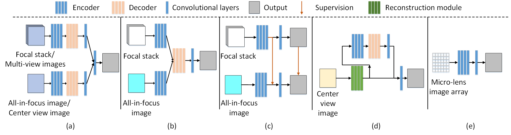
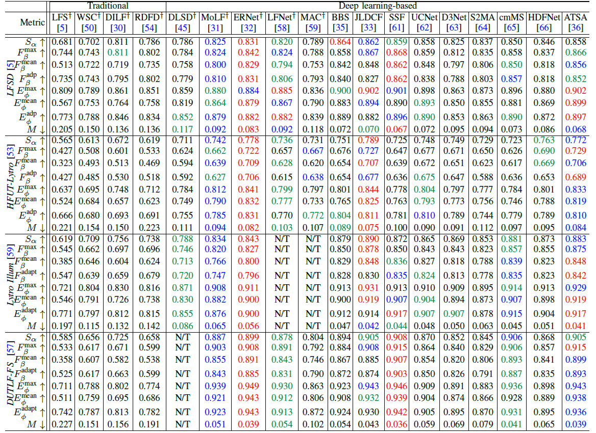
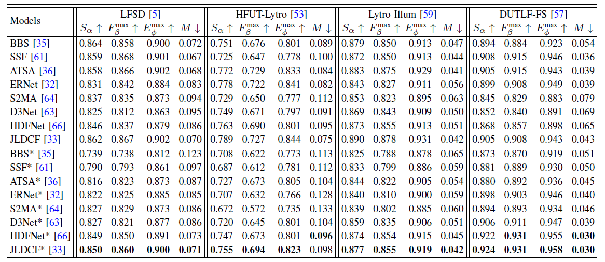
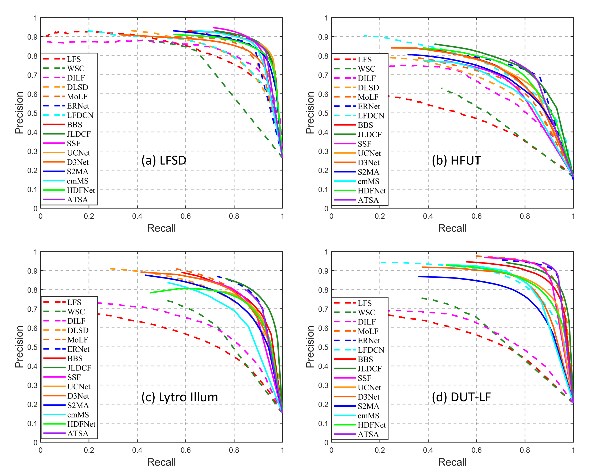
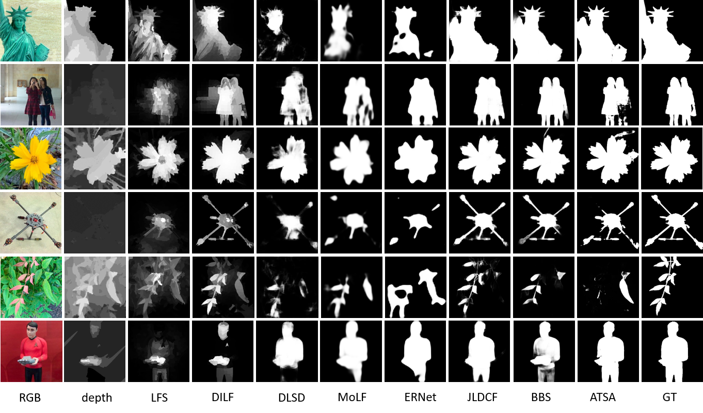
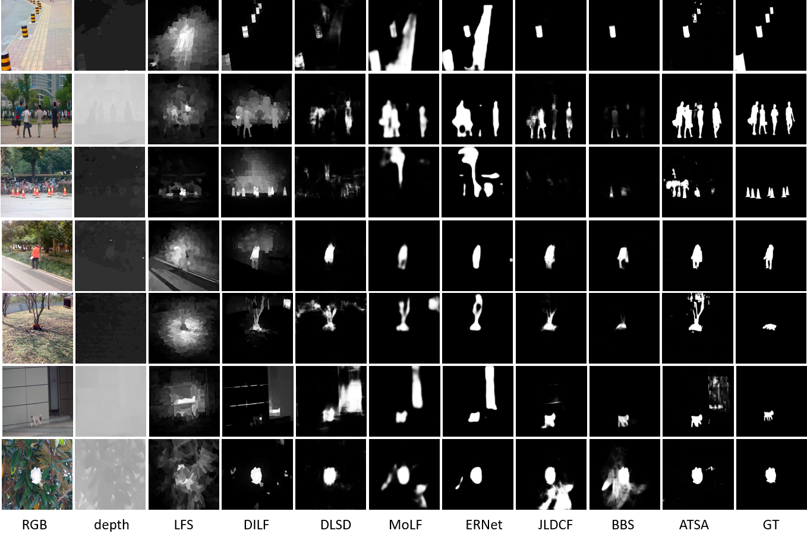

 Light Field Salient Object Detection: A Review and Benchmark [[PDF](https://link.springer.com/content/pdf/10.1007/s41095-021-0256-2.pdf)][[中文版](http://www.kerenfu.top/sources/2021cvmlfsurvey-cn.pdf)]
===============================================================================================================

# :fire:News!

* [2020/12/6] Release the information of light field datasets. [[Jump](#light-field-sod-datasets)].
* [2021/1/21] Add more description notes for the evaluation table.
* [2021/1/23] Release all models' saliency maps in our evaluation table. [[Jump](#saliency-download)].
* [2021/3/6] Add a new light field dataset [[Jump](#light-field-sod-datasets)] as well as a light field salient object detection work [[Jump](#deep-learning\-based-models)].
* [2021/7/22] Update: Supplement and improve the discussion in review and open direction sections. Benchmark models with normalized (max-min normalization) depth maps and update saliency results [[Jump](#saliency-download)]. Add one traditional model (RDFD) and one deep learning-based model (LFNet) for comparison in our benchmark. Add an experiment retraining one light field SOD model and seven RGB-D SOD models to eliminate training discrepancy [[Jump](#quantitative-comparison)]. The names of datasets are slightly changed.
* [2021/8/6] Add a new light field salient object detection work [[Jump](#deep-learning\-based-models)].
* [2021/10/3] The paper is accepted by Computational Visual Media journal (CVMJ)! [[Jump to the formal journal version](https://link.springer.com/article/10.1007/s41095-021-0256-2)]
* [2021/11/11] The Chinese version of the paper is released! [[中文版](http://www.kerenfu.top/sources/2021cvmlfsurvey-cn.pdf)].
* [2022/3/22] Add several new light field salient object detection works [[Jump](#deep-learning\-based-models)] and a new dataset [[Jump](#light-field-sod-datasets)].
* [2023/6/1] Add several new light field salient object detection works [[Jump](#deep-learning\-based-models)].

:running: **We will keep updating state-of-the-art works!** :running:    
--------------------------------------------------------------------------------------

# Contents:

1. [Light Field](#light-field) 
  i. [Multi-view Images and Focal Stacks](#multi\-view-images-and-focal-stacks)  
2. [Light Field SOD](#light-field-sod) 
  i. [Traditional Models](#traditional-models) 
  ii. [Deep Learning-based Models](#deep-learning\-based-models) 
  iii. [Other Review Works](#other-review-works) 
3. [Light Field SOD Datasets](#light-field-sod-datasets) 
4. [Benchmarking Results](#benchmarking-results) 
  i. [RGB-D SOD Models in Our Tests](#appendix) 
  ii. [Quantitative Comparison](#quantitative-comparison) 
  iii. [All Models' Saliency Maps](#saliency-download) 
  iv. [Qualitative Comparison](#qualitative-comparison) 
5. [Citation](#citation) 

# Light Field

## Multi-view Images and Focal Stacks

* A GIF animation of multi-view images in Lytro Illum.

* A GIF animation of a focal stack in Lytro Illum.

# Light Field SOD

## Traditional Models
Table I: Overview of traditional LFSOD models.

| No.  | Year | Model | pub.   | Title                                                        | Links         |
| ---- | ---- | ------ | ------ | ------------------------------------------------------------ | ------------- |
| 1    | 2014 | LFS    | CVPR   | Saliency Detection on Light Field                            | [Paper](https://sites.duke.edu/nianyi/files/2020/06/Li_Saliency_Detection_on_2014_CVPR_paper.pdf)/[Project](https://sites.duke.edu/nianyi/publication/saliency-detection-on-light-field/) |
| 2    | 2015 | WSC    | CVPR   | A Weighted Sparse Coding Framework for Saliency Detection    | [Paper](https://openaccess.thecvf.com/content_cvpr_2015/papers/Li_A_Weighted_Sparse_2015_CVPR_paper.pdf)/[Project](https://www.researchgate.net/publication/294874666_Code_WSC) |
| 3    | 2015 | DILF   | IJCAI  | Saliency Detection with a Deeper Investigation of Light Field |[Paper](https://www.ijcai.org/Proceedings/15/Papers/313.pdf)/[Project](https://github.com/pencilzhang/lightfieldsaliency_ijcai15) |
| 4    | 2016 | RL     | ICASSP | Relative location for light field saliency detection         | [Paper](http://sites.nlsde.buaa.edu.cn/~shenghao/Download/publications/2016/11.Relative%20location%20for%20light%20field%20saliency%20detection.pdf)/Project |
| 5    | 2017 | BIF    | NPL    | A Two-Stage Bayesian Integration Framework for Salient Object  Detection on Light Field | [Paper](https://link.springer.com/article/10.1007/s11063-017-9610-x)/Project |
| 6    | 2017 | LFS    | TPAMI  | Saliency Detection on Light Field                            | [Paper](https://ieeexplore.ieee.org/document/7570181)/[Project](https://sites.duke.edu/nianyi/publication/saliency-detection-on-light-field/) |
| 7    | 2017 | MA     | TOMM   | Saliency Detection on Light Field: A Multi-Cue Approach      | [Paper](http://www.linliang.net/wp-content/uploads/2017/07/ACMTOM_Saliency.pdf)/Project |
| 8    | 2018 | SDDF   | MTAP   | Accurate saliency detection based on depth feature of 3D images              | [Paper](https://link.springer.com/article/10.1007%2Fs11042-017-5052-8)/Project |
| 9    | 2018 | SGDC   | CVPR   | Salience Guided Depth Calibration for Perceptually Optimized  Compressive Light Field 3D Display | [Paper](https://ieeexplore.ieee.org/document/8578315/)/Project |
| 10   | 2020 | RDFD   | MTAP   | Region-based depth feature descriptor for saliency detection  on light field | [Paper](https://link.springer.com/article/10.1007%2Fs11042-020-08890-x)/Project |
| 11   | 2020 | DCA    | TIP    | Saliency Detection via Depth-Induced Cellular Automata on  Light Field | [Paper](https://ieeexplore.ieee.org/document/8866752)/Project |
| 12   | 2023 | CDCA    | ENTROPY    | Exploring Focus and Depth-Induced Saliency Detection for Light Field | [Paper](https://www.mdpi.com/1099-4300/25/9/1336)/Project |
| 13   | 2023 | TFSF   | AO   | Two-way focal stack fusion for light field saliency detection | [Paper](https://opg.optica.org/ao/viewmedia.cfm?uri=ao-62-34-9057&seq=0&html=true)/Project |

## Deep Learning-based Models

Fig. 1 Frameworks of deep light field SOD models. (a) Late-fusion ([DLLF](https://openaccess.thecvf.com/content_ICCV_2019/papers/Wang_Deep_Learning_for_Light_Field_Saliency_Detection_ICCV_2019_paper.pdf), [MTCNet](https://ieeexplore.ieee.org/abstract/document/9153018)). (b) Middle-fusion ([MoLF](https://papers.nips.cc/paper/8376-memory-oriented-decoder-for-light-field-salient-object-detection.pdf), [LFNet](https://ieeexplore.ieee.org/document/9082882)). (c) Knowledge distillation-based ([ERNet](https://www.aiide.org/ojs/index.php/AAAI/article/view/6860)). (d) Reconstruction-based ([DLSD](https://www.ijcai.org/Proceedings/2019/0127.pdf)). (e) Single-stream ([MAC](https://arxiv.org/pdf/1906.08331.pdf)). Note that (a) utilizes the focal stack/multi-view images and all-in-focus/center view image, while (b)-(c) utilize the
focal stack and all-in-focus image. (d)-(e) utilize the center-view image and micro-lens image array.

Table II: Overview of deep learning-based LFSOD models.

| No.  | Year | Model  | pub.   | Title                                                        | Links         |
| ---- | ---- | ------ | ------ | ------------------------------------------------------------ | ------------- |
| 1    | 2019 | DLLF   | ICCV   | Deep Learning for Light Field Saliency Detection             | [Paper](https://openaccess.thecvf.com/content_ICCV_2019/papers/Wang_Deep_Learning_for_Light_Field_Saliency_Detection_ICCV_2019_paper.pdf)/[Project](https://github.com/OIPLab-DUT/ICCV2019_Deeplightfield_Saliency) |
| 2    | 2019 | DLSD   | IJCAI  | Deep Light-field-driven Saliency Detection from a Single View | [Paper](https://www.ijcai.org/Proceedings/2019/0127.pdf)/Project |
| 3    | 2019 | MoLF   | NIPS   | Memory-oriented Decoder for Light Field Salient Object  Detection | [Paper](https://papers.nips.cc/paper/8376-memory-oriented-decoder-for-light-field-salient-object-detection.pdf)/[Project](https://github.com/OIPLab-DUT/MoLF) |
| 4    | 2020 | ERNet  | AAAI   | Exploit and Replace: An Asymmetrical Two-Stream Architecture  for Versatile Light Field Saliency Detection | [Paper](https://www.aiide.org/ojs/index.php/AAAI/article/view/6860)/[Project](https://github.com/OIPLab-DUT/AAAI2020-Exploit-and-Replace-Light-Field-Saliency) |
| 5    | 2020 | LFNet  | TIP    | LFNet: Light Field Fusion Network for Salient Object Detection | [Paper](https://ieeexplore.ieee.org/document/9082882)/Project |
| 6    | 2020 | MAC    | TIP    | Light Field Saliency Detection with Deep Convolutional Networks | [Paper](https://arxiv.org/pdf/1906.08331.pdf)/[Project](https://github.com/pencilzhang/MAC-light-field-saliency-net) |
| 7    | 2020 | MTCNet   | TCSVT    | A Multi-Task Collaborative Network for Light Field Salient Object Detection | [Paper](https://ieeexplore.ieee.org/abstract/document/9153018)/[Project](https://github.com/zhangqiudan/MTCNet-Lightfield) |
| 8    | 2021 | DUT-LFSaliency   | Arxiv    | DUT-LFSaliency: Versatile Dataset and Light Field-to-RGB Saliency Detection | [Paper](https://arxiv.org/pdf/2012.15124.pdf)/Project |
| 9    | 2021 | OBGNet   | ACM MM    | Occlusion-aware Bi-directional Guided Network for Light Field Salient Object Detection | [Paper](https://dl.acm.org/doi/10.1145/3474085.3475312)/[Project](https://github.com/Timsty1/OBGNet) |
| 10   | 2021 | DLGLRG   | ICCV   | Light Field Saliency Detection with Dual Local Graph Learning and Reciprocative Guidance | [Paper](https://arxiv.org/pdf/2110.00698.pdf)/[Project](https://github.com/wangbo-zhao/2021ICCV-DLGLRG) |
| 11   | 2021 | GAGNN   | IEEE TIP   | Geometry Auxiliary Salient Object Detection for Light Fields via Graph Neural Networks | [Paper](https://ieeexplore.ieee.org/stamp/stamp.jsp?tp=&arnumber=9527158)/[Project](https://github.com/zhangqiudan/GeoSOD-Lightfield) |
| 12   | 2021 | SANet   | BMVC   | Learning Synergistic Attention for Light Field Salient Object Detection | [Paper](https://arxiv.org/abs/2104.13916)/[Project](https://github.com/PanoAsh/SA-Net) |
| 13   | 2021 | TCFANet   | IEEE SPL   | Three-Stream Cross-Modal Feature Aggregation Network for Light Field Salient Object Detection | [Paper](https://ieeexplore.ieee.org/stamp/stamp.jsp?tp=&arnumber=9292968&tag=1)/Project |
| 14   | 2021 | PANet   | IEEE TCYB   | PANet: Patch-Aware Network for Light Field Salient Object Detection | [Paper](https://ieeexplore.ieee.org/document/9517032)/[Project](https://github.com/OIPLab-DUT/IEEE-TCYB-PANet) |
|  15  | 2021 | MGANet   | IEEE ICMEW   | Multi-Generator Adversarial Networks For Light Field Saliency Detection | [Paper](https://ieeexplore.ieee.org/document/9456017)/Project |
|  16  | 2022 | MEANet   | Neurocomputing   | MEANet: Multi-Modal Edge-Aware Network for Light Field Salient Object Detection | [Paper](https://www.sciencedirect.com/science/article/pii/S0925231222003502)/[Project](https://github.com/jiangyao-scu/MEANet) |
|  17  | 2022 | DGENet   | IVC   | Dual guidance enhanced network for light field salient object detection | [Paper](https://www.sciencedirect.com/science/article/pii/S0262885621002572?via%3Dihub)/Project |
| 18   | 2022 | NoiseLF  | CVPR   | Learning from Pixel-Level Noisy Label : A New Perspective for Light Field Saliency Detection | [Paper](https://openaccess.thecvf.com/content/CVPR2022/papers/Feng_Learning_From_Pixel-Level_Noisy_Label_A_New_Perspective_for_Light_CVPR_2022_paper.pdf)/[Project](https://github.com/OLobbCode/NoiseLF) |
| 19    | 2022 | ARFNet  | IEEE Systems Journal   | ARFNet: Attention-Oriented Refinement and Fusion Network for Light Field Salient Object Detection | [Paper](https://ieeexplore.ieee.org/abstract/document/9763843)/Project |
| 20    | 2022 |  -- | IEEE TIP   | Weakly-Supervised Salient Object Detection on Light Fields | [Paper](https://ieeexplore.ieee.org/abstract/document/9900489)/Project |
| 21    | 2022 | ESCNet  | IEEE TIP   | Exploring Spatial Correlation for Light Field Saliency Detection: Expansion From a Single View | [Paper](https://ieeexplore.ieee.org/abstract/document/9894273)/[Project](https://github.com/OIPLab-DUT/ESCNet) |
| 22    | 2022 |  LFBCNet | ACM MM| LFBCNet: Light Field Boundary-aware and Cascaded Interaction Network for Salient Object Detection | [Paper](https://dl.acm.org/doi/abs/10.1145/3503161.3548275)/Project |
| 23    | 2023 |  TENet | IVC| TENet: Accurate light-field salient object detection with a transformer embedding network | [Paper](https://www.sciencedirect.com/science/article/pii/S0262885622002244)/Project |
| 24    | 2023 | -- | TPAMI| A Thorough Benchmark and a New Model for Light Field Saliency Detection | [Paper](https://ieeexplore.ieee.org/abstract/document/10012539)/[Project](https://openi.pcl.ac.cn/OpenDatasets) |
| 25    | 2023 | GFRNet | ICME| Guided Focal Stack Refinement Network For Light Field Salient Object Detection | [Paper](https://ieeexplore.ieee.org/document/10219904)/[Project](https://github.com/Yboera/GFRNet) |
| 26    | 2023 | FESNet | IEEE TMM| Fusion-Embedding Siamese Network for Light Field Salient Object Detection | [Paper](https://ieeexplore.ieee.org/abstract/document/10122696)/Project |
| :fire: 27    | 2023 | LFTransNet | IEEE TCSVT|LFTransNet: Light Field Salient Object Detection via a Learnable Weight Descriptor | [Paper](https://ieeexplore.ieee.org/abstract/document/10138590?casa_token=rJeI2PnLzwQAAAAA:nnJc89z7hCRfJH3C-GtVjybe1HL11dZVoWOxzZ45d4Jn623BW4ZM9bS8DdyBiuvW-2zeyW7fdYJgkQ)/[Project](https://github.com/liuzywen/LFTransNet)  |
| :fire: 28    | 2023 | CDINet | IEEE TCSVT|Light Field Salient Object Detection with Sparse Views via Complementary and Discriminative Interaction Network | [Paper](https://ieeexplore.ieee.org/document/10168184)/[Project](https://github.com/GilbertRC/LFSOD-CDINet)  |
| :fire: 29    | 2024 | LF-Tracy| arXiv|LF Tracy: A Unified Single-Pipeline Approach for Salient Object Detection in Light Field Cameras| [Paper](https://browse.arxiv.org/abs/2401.16712)/[Project](https://github.com/FeiBryantkit/LF-Tracy)  |
| :fire: 30    | 2024 | PANet| IEEE SPL|Parallax-Aware Network for Light Field Salient Object Detection| [Paper](https://ieeexplore.ieee.org/document/10461057)/Project |

## Other Review Works

Table III: Overview of related reviews and surveys to LFSOD.

| No.  | Year | Model  | pub.   | Title                                                        | Links         |
| ---- | ---- | ------ | ------ | ------------------------------------------------------------ | ------------- |
| 1    | 2015 | CS     | NEURO  | Light field saliency vs.2D saliency : A comparative study    | [Paper](https://www.sciencedirect.com/science/article/abs/pii/S0925231215003410?via%3Dihub)/Project |
| 2    | 2020 |RGBDS   | CVM    | RGB-D Salient Object Detection: A Survey                     | [Paper](https://arxiv.org/pdf/2008.00230.pdf)/[Project](https://github.com/taozh2017/RGBD-SODsurvey) |

# Light Field SOD Datasets

Table IV: Overview of light field SOD datasets. About the abbreviations: MOP=Multiple-Object Proportion (The percentage of images regarding the entire dataset, which have more than one objects per image), FS=Focal Stacks, DE=Depth maps, MV=Multi-view images, ML=Micro-lens images, GT=Ground-truth, Raw=Raw light field data. FS, MV, DE, ML, GT and Raw indicate the data provided by the datasets. `'✓' denotes the data forms provided in the original datasets, while '✔️' indicates the data forms generated by us`. Original data forms as well as supplement data forms can be download at 'Download' with the fetch code: `'lfso'`. You can also download original dataset in 'Original Link'.

| No.  | Dataset     | Year | Pub.     | Size | MOP  | FS   | MV   | DE   | ML   | GT   | Raw  | Download | Original Link |
| ---- | ----------- | ---- | -------- | ---- | ---- | ---- | ---- | ---- | ---- | ---- | ---- | -------- | ------------- |
| 1    | LFSD        | 2014 | CVPR     | 100  | 0.04 | ✓    | ✔️  |   ✓  | ✔️   |   ✓  |  ✓  | [Link](https://pan.baidu.com/s/1fMu8X1ApEdDif5gFGrPgkw) | [Link](https://sites.duke.edu/nianyi/publication/saliency-detection-on-light-field/)    |
| 2    | HFUT-Lytro  | 2017 | ACM TOMM | 255  | 0.29 | ✓ | ✓ | ✓ |    ✔️  |✓  |      | [Link](https://pan.baidu.com/s/1-lyL88LMGBfhsaSdL5li4w) | [Link](https://github.com/pencilzhang/MAC-light-field-saliency-net)    |
| 3    | DUTLF-FS    | 2019 | ICCV     | 1462 | 0.05 |✓  |      |✓  |      |✓  |      | [Link](https://pan.baidu.com/s/1J-LXu9iM1BH0SVeyUXogIw) | [Link](https://github.com/OIPLab-DUT/ICCV2019_Deeplightfield_Saliency)   |
| 4    | DUTLF-MV    | 2019 | IJCAI    | 1580 | 0.04 |      |✓  |      |      |✓  |      | [Link](https://drive.google.com/drive/folders/1zpvWA0bNvh7o6VEeNldQexAsXOn7WkIq?usp=share_link) | [Link](https://github.com/OIPLab-DUT/IJCAI2019-Deep-Light-Field-Driven-Saliency-Detection-from-A-Single-View)     |
| 5    | Lytro Illum | 2020 | IEEE TIP | 640  | 0.15 |   ✔️   |    ✔️  |    ✔️  |✓  |✓  |✓  | [Link](https://pan.baidu.com/s/1TOFhB5uB9sRuuzvkLcLobQ) | [Link](https://github.com/pencilzhang/MAC-light-field-saliency-net)     |
| 6    | DUTLF-V2 | 2021 | Arxiv | 4204  |  |  ✓    |    ✓  |    ✓  |✓  |✓  |✓  |  | [Link](https://github.com/OIPLab-DUT/DUTLF-V2)     |
| :fire: 7    | CITYU-Lytro | 2021 | IEEE TIP | 817  |  |      |    ✓  |    ✓  |✓  |✓  |✓  |  |      |
| :fire: 8    | PKU-LF | 2021 | TPAMI | 5000  |   |   ✓   |    ✓  |    ✓  |✓  |✓  |✓  |  |   [Link](https://openi.pcl.ac.cn/OpenDatasets)   |

# Benchmarking Results

## RGB-D SOD Models in Our Tests

Table V: Overview of RGB-D SOD models in our tests.

| No.  | Year | Model | Pub.       | Title                                                        | Links                                                        |
| ---- | ---- | ------ | ---------- | ------------------------------------------------------------ | ------------------------------------------------------------ |
| 1    | 2020 | BBS    | ECCV       | BBS-Net: RGB-D Salient Object Detection with a Bifurcated Backbone Strategy Network | [Paper](https://arxiv.org/pdf/2007.02713.pdf)/[Project](https://github.com/zyjwuyan/BBS-Net) |
| 2    | 2020 | JLDCF  | CVPR       | JL-DCF: Joint learning and densely-cooperative fusion framework for RGB-D salient object detection | [Paper](https://openaccess.thecvf.com/content_CVPR_2020/papers/Fu_JL-DCF_Joint_Learning_and_Densely-Cooperative_Fusion_Framework_for_RGB-D_Salient_CVPR_2020_paper.pdf)/[Project](https://github.com/kerenfu/JLDCF) |
| 3    | 2020 | SSF    | CVPR       | Select, supplement and focus for RGB-D saliency detection    | [Paper](https://openaccess.thecvf.com/content_CVPR_2020/papers/Zhang_Select_Supplement_and_Focus_for_RGB-D_Saliency_Detection_CVPR_2020_paper.pdf)/[Project](https://github.com/OIPLab-DUT/CVPR_SSF-RGBD) |
| 4    | 2020 | UCNet  | CVPR       | UC-Net: Uncertainty Inspired RGB-D Saliency Detection via Conditional Variational Autoencoders | [Paper](https://openaccess.thecvf.com/content_CVPR_2020/papers/Zhang_UC-Net_Uncertainty_Inspired_RGB-D_Saliency_Detection_via_Conditional_Variational_Autoencoders_CVPR_2020_paper.pdf)/[Project](https://github.com/JingZhang617/UCNet) |
| 5    | 2020 | D3Net  | IEEE TNNLS | Rethinking RGB-D salient object detection: models, datasets, and large-scale benchmarks | [Paper](https://arxiv.org/pdf/1907.06781.pdf)/[Project](https://github.com/DengPingFan/D3NetBenchmark) |
| 6    | 2020 | S2MA   | CVPR       | Learning selective self-mutual attention for RGB-D saliency detection | [Paper](https://openaccess.thecvf.com/content_CVPR_2020/papers/Liu_Learning_Selective_Self-Mutual_Attention_for_RGB-D_Saliency_Detection_CVPR_2020_paper.pdf)/[Project](https://github.com/nnizhang/S2MA) |
| 7    | 2020 | cmMS   | ECCV       | RGB-D salient object detection with cross-modality modulation and selection | [Paper](https://arxiv.org/pdf/2007.07051.pdf)/[Project](https://github.com/Li-Chongyi/cmMS-ECCV20) |
| 8    | 2020 | HDFNet | ECCV       | Hierarchical Dynamic Filtering Network for RGB-D Salient Object Detection | [Paper](https://arxiv.org/pdf/2007.06227.pdf)/[Project](https://github.com/lartpang/HDFNet) |
| 9    | 2020 | ATSA   | ECCV       | Asymmetric Two-Stream Architecture for Accurate RGB-D Saliency Detection | [Paper](https://www.ecva.net/papers/eccv_2020/papers_ECCV/papers/123730375.pdf)/[Project](https://github.com/sxfduter/ATSA) |

## Quantitative Comparison

Table VI: Quantitative measures: S-measure (*S&alpha;*), max F-measure (*F&beta;max*), mean F-measure (*F&beta;mean*), adaptive F-measure (*F&beta;adp*), max E-measure (*E&Phi;max*), mean E-measure (*E&Phi;mean*), adaptive E-measure (*E&Phi;adp*), and MAE (*M*) of nine light field SOD models (i.e., [LFS](https://sites.duke.edu/nianyi/files/2020/06/Li_Saliency_Detection_on_2014_CVPR_paper.pdf), [WSC](https://openaccess.thecvf.com/content_cvpr_2015/papers/Li_A_Weighted_Sparse_2015_CVPR_paper.pdf), [DILF](https://www.ijcai.org/Proceedings/15/Papers/313.pdf), [RDFD](https://link.springer.com/article/10.1007%2Fs11042-020-08890-x), [DLSD](https://www.ijcai.org/Proceedings/2019/0127.pdf), [MoLF](https://papers.nips.cc/paper/8376-memory-oriented-decoder-for-light-field-salient-object-detection.pdf), [ERNet](https://www.aiide.org/ojs/index.php/AAAI/article/view/6860), [LFNet](https://ieeexplore.ieee.org/document/9082882), [MAC](https://arxiv.org/pdf/1906.08331.pdf)) and nine SOTA RGB-D based SOD models (i.e., [BBS](https://arxiv.org/pdf/2007.02713.pdf), [JLDCF](https://openaccess.thecvf.com/content_CVPR_2020/papers/Fu_JL-DCF_Joint_Learning_and_Densely-Cooperative_Fusion_Framework_for_RGB-D_Salient_CVPR_2020_paper.pdf), [SSF](https://openaccess.thecvf.com/content_CVPR_2020/papers/Zhang_Select_Supplement_and_Focus_for_RGB-D_Saliency_Detection_CVPR_2020_paper.pdf), [UCNet](https://openaccess.thecvf.com/content_CVPR_2020/papers/Zhang_UC-Net_Uncertainty_Inspired_RGB-D_Saliency_Detection_via_Conditional_Variational_Autoencoders_CVPR_2020_paper.pdf), [D3Net](https://arxiv.org/pdf/1907.06781.pdf), [S2MA](https://openaccess.thecvf.com/content_CVPR_2020/papers/Liu_Learning_Selective_Self-Mutual_Attention_for_RGB-D_Saliency_Detection_CVPR_2020_paper.pdf), [cmMS](https://arxiv.org/pdf/2007.07051.pdf), [HDFNet](https://arxiv.org/pdf/2007.06227.pdf), and [ATSA](https://www.ecva.net/papers/eccv_2020/papers_ECCV/papers/123730375.pdf)).  
*Note in the table, light field SOD models are marked by "&dagger;". Symbol “N/T” indicates that a model was trained on quite some images from the corresponding dataset, and, thus, it is not tested. The top three models among light field and RGB-D based SOD models are highlighted in `red`, `blue` and `green`, `separately`. &uarr;/&darr; denotes that a larger/smaller value is better.* 
`Other important notes:` 
`1). There are TWO types of ground-truth (GT) corresponding to focal stacks and multi-view images due to an inevitable issue of software used for generation, and there are usually shifts between them. Models using different data with different GT are not directly comparable. Luckly, this problem is avoided, as in the table, all the models on the same dataset are based on the SINGLE GT type of focal stacks.` 
`2). On LFSD, model MAC is tested on micro-lens image arrays, whose GT is dffierent from that of other models. As a solution, we find the transfomration between these two GT types and then again transform the MAC's results to make them aligned to the other GT type. Generally, we find the differences of metric numbers are quite small before and after transform.` 
`3). Again about MAC, on DUTLF-FS and HFUT-Lytro, MAC is tested on single up-sampled all-in-focus images.` 
`4). On HFUT-Lytro, ERNet is only tested on 155 images, since it used the remaining 100 images for training. So the obtain metric numbers are only for reference, as the other models are tested on 255 images.` 

:fire: Table VII: Quantitative measures: S-measure (*S&alpha;*), max F-measure (*F&beta;max*), max E-measure (*E&Phi;max*), and MAE (*M*) of one retrained light field SOD model ([ERNet](https://www.aiide.org/ojs/index.php/AAAI/article/view/6860)) and seven retrained RGB-D based SOD models (ie, [BBS](https://arxiv.org/pdf/2007.02713.pdf), [SSF](https://openaccess.thecvf.com/content_CVPR_2020/papers/Zhang_Select_Supplement_and_Focus_for_RGB-D_Saliency_Detection_CVPR_2020_paper.pdf), [ATSA](https://www.ecva.net/papers/eccv_2020/papers_ECCV/papers/123730375.pdf),  [S2MA](https://openaccess.thecvf.com/content_CVPR_2020/papers/Liu_Learning_Selective_Self-Mutual_Attention_for_RGB-D_Saliency_Detection_CVPR_2020_paper.pdf), [D3Net](https://arxiv.org/pdf/1907.06781.pdf), [HDFNet](https://arxiv.org/pdf/2007.06227.pdf), and [JLDCF](https://openaccess.thecvf.com/content_CVPR_2020/papers/Fu_JL-DCF_Joint_Learning_and_Densely-Cooperative_Fusion_Framework_for_RGB-D_Salient_CVPR_2020_paper.pdf)). Note in the table, the results of original models are taken from Table VI, and the retrained models are marked by `*`. The best results of retrained models are highlighted in bold. &uarr;/&darr; denotes that a larger/smaller value is better.

Fig. 2 PR curves on four datasets ((a) LFSD, (b) HFUT-Lytro, (c) Lytro Illum, and (d) DUTLF-FS) for nine light field SOD models (i.e., [LFS](https://sites.duke.edu/nianyi/files/2020/06/Li_Saliency_Detection_on_2014_CVPR_paper.pdf), [WSC](https://openaccess.thecvf.com/content_cvpr_2015/papers/Li_A_Weighted_Sparse_2015_CVPR_paper.pdf), [DILF](https://www.ijcai.org/Proceedings/15/Papers/313.pdf), [RDFD](https://link.springer.com/article/10.1007%2Fs11042-020-08890-x), [DLSD](https://www.ijcai.org/Proceedings/2019/0127.pdf), [MoLF](https://papers.nips.cc/paper/8376-memory-oriented-decoder-for-light-field-salient-object-detection.pdf), [ERNet](https://www.aiide.org/ojs/index.php/AAAI/article/view/6860), [LFNet](https://ieeexplore.ieee.org/document/9082882), [MAC](https://arxiv.org/pdf/1906.08331.pdf)) and nine SOTA RGB-D based SOD models (i.e., [BBS](https://arxiv.org/pdf/2007.02713.pdf), [JLDCF](https://openaccess.thecvf.com/content_CVPR_2020/papers/Fu_JL-DCF_Joint_Learning_and_Densely-Cooperative_Fusion_Framework_for_RGB-D_Salient_CVPR_2020_paper.pdf), [SSF](https://openaccess.thecvf.com/content_CVPR_2020/papers/Zhang_Select_Supplement_and_Focus_for_RGB-D_Saliency_Detection_CVPR_2020_paper.pdf), [UCNet](https://openaccess.thecvf.com/content_CVPR_2020/papers/Zhang_UC-Net_Uncertainty_Inspired_RGB-D_Saliency_Detection_via_Conditional_Variational_Autoencoders_CVPR_2020_paper.pdf), [D3Net](https://arxiv.org/pdf/1907.06781.pdf), [S2MA](https://openaccess.thecvf.com/content_CVPR_2020/papers/Liu_Learning_Selective_Self-Mutual_Attention_for_RGB-D_Saliency_Detection_CVPR_2020_paper.pdf), [cmMS](https://arxiv.org/pdf/2007.07051.pdf), [HDFNet](https://arxiv.org/pdf/2007.06227.pdf), and [ATSA](https://www.ecva.net/papers/eccv_2020/papers_ECCV/papers/123730375.pdf)). `Note that in this figure, the solid lines and dashed lines represent the PR curves of RGB-D based SOD models and light field SOD models, respectively. `

## All Models' Saliency Maps

All models' saliency maps generated and used for our evaluation table are now publicly available at [Baidu Pan](https://pan.baidu.com/s/1geuT85EL9QC-vmLBYW1feQ) (code: lfso) or [Google Drive](https://drive.google.com/drive/folders/1x901OaZa1L7nckl2H9rHncN6o45KwSqr?usp=sharing).

## Qualitative Comparison

Fig. 3 Visual comparison of five light field SOD (i.e., [LFS](https://sites.duke.edu/nianyi/files/2020/06/Li_Saliency_Detection_on_2014_CVPR_paper.pdf), [DILF](https://www.ijcai.org/Proceedings/15/Papers/313.pdf), [DLSD](https://www.ijcai.org/Proceedings/2019/0127.pdf), [MoLF](https://papers.nips.cc/paper/8376-memory-oriented-decoder-for-light-field-salient-object-detection.pdf), [ERNet](https://www.aiide.org/ojs/index.php/AAAI/article/view/6860), , bounded in the green box) and
three SOTA RGB-D based SOD models (i.e., [JLDCF](https://openaccess.thecvf.com/content_CVPR_2020/papers/Fu_JL-DCF_Joint_Learning_and_Densely-Cooperative_Fusion_Framework_for_RGB-D_Salient_CVPR_2020_paper.pdf), [BBS](https://arxiv.org/pdf/2007.02713.pdf), and [ATSA](https://www.ecva.net/papers/eccv_2020/papers_ECCV/papers/123730375.pdf), bounded in the red box). `The first two rows in this figure show easy cases while the third to fifth rows show cases with complex backgrounds or sophisticated boundaries. The last row gives an example with low color contrast between foreground and background.`

Fig. 4 Visual comparison of five light field SOD (i.e., [LFS](https://sites.duke.edu/nianyi/files/2020/06/Li_Saliency_Detection_on_2014_CVPR_paper.pdf), [DILF](https://www.ijcai.org/Proceedings/15/Papers/313.pdf), [DLSD](https://www.ijcai.org/Proceedings/2019/0127.pdf), [MoLF](https://papers.nips.cc/paper/8376-memory-oriented-decoder-for-light-field-salient-object-detection.pdf), [ERNet](https://www.aiide.org/ojs/index.php/AAAI/article/view/6860), , bounded in the green box) and
three SOTA RGB-D based SOD models (i.e., [JLDCF](https://openaccess.thecvf.com/content_CVPR_2020/papers/Fu_JL-DCF_Joint_Learning_and_Densely-Cooperative_Fusion_Framework_for_RGB-D_Salient_CVPR_2020_paper.pdf), [BBS](https://arxiv.org/pdf/2007.02713.pdf), and [ATSA](https://www.ecva.net/papers/eccv_2020/papers_ECCV/papers/123730375.pdf), bounded in the red box) on detecting multiple (first three rows) and small objects (remaining rows). 

# Citation
Please cite our paper if you find the work useful: 

	@article{Fu2021lightfieldSOD,
	title={Light Field Salient Object Detection: A Review and Benchmark},
	author={Fu, Keren and Jiang, Yao and Ji, Ge-Peng and Zhou, Tao and Zhao, Qijun and Fan, Deng-Ping},
	journal={Computational Visual Media},
	volume={8},
	number={4},
	pages={509--534},
	year={2022},
	publisher={Springer}
	}
